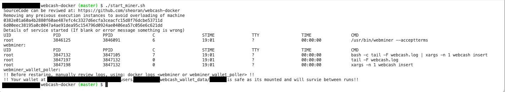

# webcash-docker

Ready to use docker image packaged with
    1. https://github.com/kanzure/webcash
    2. https://github.com/maaku/webminer

## Quick start of mining and storing of tokens

1. `./start_miner.sh`, It will create folder where wallet data be will be kept `webcash_wallet_data`
2. Validate images are running by `docker ps -n 2`, should be similar to screenshot 
3. Wallet operations
   1.  `./cash.sh --help`

## Build and push image locally if you have perm

        docker build -t sheoran/webcash:latest .
        docker push sheoran/webcash:latest

